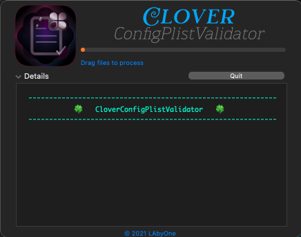

# CloverConfigPlistValidator-app
Little app to help validate your config.plist

##

##
Direct [Download](https://github.com/LAbyOne/CloverConfigPlistValidator-app/raw/main/CloverConfigPlistValidator.dmg)
##
This is meant to be used with ccpv installed by clover into `/usr/local/bin`.
##

