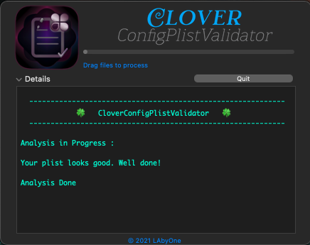

# CloverConfigPlistValidator

##
Version  1.2

Added search path for those who Clones Clover (as is from github i.e. CloverBootloader) 
##

##

##

##
This updated version will work either:

 with ccpv installed by clover into `/usr/local/bin`,

or use the one compiled into Clover source, will it be `ccpv or CloverConfigPlistValidator_xxxx`.
##
Direct [Download](https://github.com/LAbyOne/CloverConfigPlistValidator-app/raw/main/CloverConfigPlistValidator_1.2.dmg)
##
